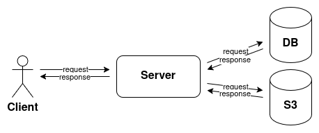

# 📝 Summary
Welltoon is a webtoon management RESTful API built using Golang and Fiber framework.
It supports authentication, user management, comic and chapter CRUD, genre tagging, and file uploads via S3-compatible services like MinIO.

---

## 🌏 Flow



---

## 📦 Requirements

- [Go](https://go.dev/) - Programming language used to build the backend
- [FIBER](https://gofiber.io/) - Framework to build web services
- [GORM](https://gorm.io/) - ORM library for Golang
- [MySQL](https://www.mysql.com/) - Relational database
- [MinIO (S3 compatible)](https://min.io/) - Object storage for media files
- [Go Validator](https://github.com/go-playground/validator) - Struct validation library
- [Docker](https://www.docker.com/) - Container platform to run the app and services

---

## ⚙️ Environment Variables (.env)

```env
APP_NAME="gofiber starterkit mysql"

# Database
DB_MYSQL_URL="user:password@tcp(localhost:3306)/yourdb?charset=utf8mb4&parseTime=True&loc=Local"
DB_POOL_MAX_IDLE_CONNS=5
DB_POOL_MAX_OPEN_CONNS=15
DB_POOL_MAX_IDLE_TIME=10 # minute
DB_POOL_MAX_LIFETIME=30 # minute

# JWT
JWT_SECRET_KEY="your-secret"

# Origin URL (Frontend)
ORIGIN_URL="your-origin-url"

# MinIO (S3-compatible)
MINIO_ENDPOINT=localhost:9000
MINIO_ACCESS_KEY_ID=example
MINIO_SECRET_ACCESS_KEY=example
MINIO_SSL=false # boolean
MINIO_BUCKETS=example
```

---

## 📘 API Documentation

This document provides an overview of the available RESTful API endpoints for the **Welltoon** web application.

> 🧪 Base URL: `http://localhost:3000`

---

### 🔐 Authentication

#### ➕ Register
**POST** `/api/auth/register`

**Request Body:**
```json
{
  "username": "user",
  "password": "user"
}
```

---

#### 🔓 Login
**POST** `/api/auth/login`

**Request Body:**
```json
{
  "username": "user",
  "password": "user"
}
```

---

### 👤 User

#### 🔍 Get User by ID
**GET** `/api/users/:id`  
> Requires Authorization header

#### ✏️ Update Username
**PUT** `/api/users/:id`  
> Requires Authorization header  
**Body:**
```json
{
  "username": "new_username"
}
```

#### 🖼️ Upload Avatar
**PUT** `/api/users/:id/upload`  
> Requires Authorization header  
> FormData:
- `avatar`: file

---

### 📚 Comic

#### ➕ Add Comic
**POST** `/api/comics`  
> Requires Authorization header  
> FormData:
- `cover`: file
- `title`, `synopsis`, `author`, `artist`, `type`: text

#### ✏️ Update Comic
**PUT** `/api/comics/:id`  
> Requires Authorization header  
> FormData (optional fields, can be disabled): cover, title, synopsis, author, artist, type

#### 🔍 Get Comic by ID
**GET** `/api/comics/:id`

#### 📖 Get All Comics Update
**GET** `/api/comics?page=1&size=20`

#### 📖 Get All Comics By Type
**GET** `/api/comics/type/:type?page=1&size=20`

#### 📖 Get All Comics By Type
**GET** `/api/comics/period/:period?limit=10`

#### ✏️ Update Views Comic
**GET** `/api/comics/:comicId/views/:views`

#### 🔍 Search Comics
**GET** `/api/search?keyword=...&page=1&size=20`

#### 🗑️ Delete Comic
**DELETE** `/api/comics/:id`  
> Requires Authorization header

---

### 🏷️ Genre

#### ➕ Add Genre
**POST** `/api/genres`  
> Requires Authorization header  
**Body:**
```json
{
  "name": "Horror"
}
```

#### 📖 Get All Genres
**GET** `/api/genres`

#### 🔍 Get Genre by ID
**GET** `/api/genres/:id?page=1&size=20`

#### 🗑️ Delete Genre
**DELETE** `/api/genres/:id`  
> Requires Authorization header

---

### 📌 Comic-Genre Mapping

#### ➕ Add Comic to Genre
**POST** `/api/comic-genre`  
> Requires Authorization header  
**Body:**
```json
{
  "comic_id": "...",
  "genre_id": 1
}
```

#### 🗑️ Remove Comic from Genre
**DELETE** `/api/comic-genre/comics/:comicId/genres/:genreId`  
> Requires Authorization header

---

### 📖 Chapter

#### ➕ Add Chapter
**POST** `/api/comics/:comicId/chapters`  
> Requires Authorization header  
**Body:**
```json
{
  "comic_id": "...",
  "number": 14
}
```

#### ✏️ Update Chapter
**PUT** `/api/comics/:comicId/chapters/:chapterId`  
> Requires Authorization header  
**Body:**
```json
{
  "publish": false
}
```

#### 🗑️ Delete Chapter
**DELETE** `/api/comics/:comicId/chapters/:chapterId`  
> Requires Authorization header

#### 🔍 Get Chapter by Comic ID and Number
**GET** `/api/comics/:comicId/chapters/:number`

---

### 📄 Content

#### 📥 Add Bulk Content
**POST** `/api/comics/:comicId/chapters/:chapterId/contents`  
> Requires Authorization header  
> FormData:
- `contents`: multiple image files

#### 🗑️ Delete Content
**DELETE** `/api/comics/:comicId/chapters/:chapterId/contents/:contentId`  
> Requires Authorization header

---

### 📄 Dashboard

#### 📖 Summary
**GET** `/api/dashboard/summary`  
> Requires Authorization header

---

### 📌 Notes
- Use `Authorization: Bearer <token>` header where required.
- Make sure to replace `:id`, `:comicId`, `:chapterId`, `:contentId`, etc. with actual UUIDs or IDs.

---